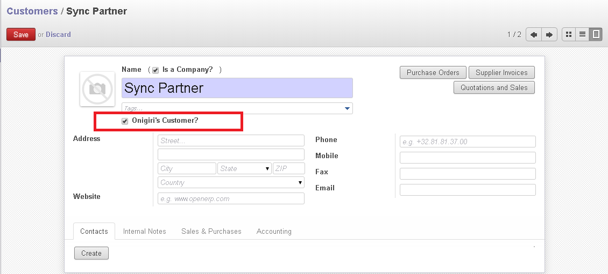

# Onigiri Voucher (Open Invoice)

## Introduction

Fungsi dari untuk module ini untuk mengkonsolidasi beberapa invoice dan menjadikan satu voucher.
Voucher harus di print dan mengasih ke team Akun.

Voucher ini di generate berdasarkan, satu voucher terdiri dari beberapa customer dengan ` Invoice Date ` yang sama dan ` Payment Term ` yang sama dengan status ` Open `.

** Contoh: **

Pada tanggal 13/06/2017, kita mendapat beberapa invoices seperti data di table bawah:

|Invoice Date|Invoice No|Partner|Payment Term|Amount|Status|
|------------|----------|-------|------------|------|------|
|13/06/2017| inv001| Pak Agus | 3 Hari| Rp 200,000|Open|
|13/06/2017| inv002| Bu Nengsi | 7 Hari| Rp 100,000|Open|
|13/06/2017| inv003| PT Amira | 3 Hari| Rp 1,200,000|Open|
|13/06/2017| inv004| Pak Agus | 3 Hari| Rp 250,000|Paid|
|13/06/2017| inv005| Hajianto | 7 Hari| Rp 150,000|Open|
|13/06/2017| inv006| Supermarket | 3 Hari| Rp 2,000,000|Paid|
|13/06/2017| inv007| Sekolah | 10 Hari| Rp 200,000|Open|

Berikut ` Onigiri Voucher ` yang bisa di olah dari data atas:

1. inv001, inv003 bisa di jadikan 1 Voucher karena **Invoice Date**, **Payment Term** (3 Hari) dan statusnya = **Open**.
2. inv002, inv005 bisa di jadikan 1 Voucher karena **Invoice Date**, **Payment Term** (7 Hari) dan statusnya = **Open**.
3. inv007 jadikan 1 Voucher karena **Invoice Date**, **Payment Term** (10 Hari) dan statusnya = **Open**.
4. Tetapi, untuk inv004 dan inv006 tidak di buat voucher karena statusnya **Paid** artinya invoices itu sudah terbayar dan tidak perlu lagi di buat voucher.

## Open Invoice

Sebelum bisa membuat voucher, kita perlu memenuhi beberapa settingan di `Customer`, untuk detail bisa lihat di [Setting untuk customer](#setting-untuk-customer).
Setelah setting di customer sudah selesai, sekarang lah kita bisa membuat ` Onigiri Voucher / Open Invoice `.

### Menu

>  Sales > Onigiri > Open Invoice

### Membuat Open Invoice/Onigiri Voucher

* Tekan ` Create `

* Masukan data awal di __[Header Section]__ 

|Fields|Required|Descriptions|Default|
|------|--------|------------|-------|
|Journal|Yes|Sudah ada di isikan system di awal. Bila tidak perubahan tidak
perlu di ganti||
|Invoice Date|Yes|Tanggal Invoice|Tanggal hari ni|
|Payment Term|Yes|Termin Pembayaran||
|Due Date|-|Tanggal Jatuh tempo. System akan isikan sesuai `Payment Term` yang di pilih||

* Setelah data di [Header Section] sudah benar, kita ke __[Action Section]__ klik button `Open Invoice `
* Bila data di [Header Section] tidak masalah. System akan isikan Invoices ke __[Detail Section]__ dan system akan generate juga nomor untuk Voucher yang akan show di [Header Section]

Di bawah adalah image sebagai contoh bila open invoice setelah create:

### Print Onigiri Voucher

* Tekan ` Print > Open Invoice `

Berikut sample __Onigiri Voucher__:

Dan mao contoh untuk di print [download](files/open_invoice_onigiri_voucher.pdf)

### Cancel atau Update Voucher

Bila terjadi perubahan yang ingin di re-print di onigiri voucher.
`Onigiri Voucher` tidak  bisa membuat update. Jadi, waktu ingin merubah voucher,
user perlu melakukan step berikut:

1. Cancel

2. Set Draft

3. Open Invoice

Setelah `Set Draft`, data di [Detail Section] akan terhapus.
Kita bisa klik tombol `Open Invoice` untuk membuat baru kembali

## Monitoring Pembayaran

User can monitor voucher dengan `Status` dan `Due Date`

## Status

### Open

Voucher yang invoice nya ada status yang belum terbayar. 

### Close

Voucher itu akan `Close` sendiri waktu invoice semua sudah dalam keadaan `Paid`.
Ini smua di lakukan oleh system.

## Setting untuk customer

Untuk memakai `Open Invoice`, user perlu buat setting di `Customer`

1. Menentukan customer's Onigiri

2. Menentukan Payment Term

